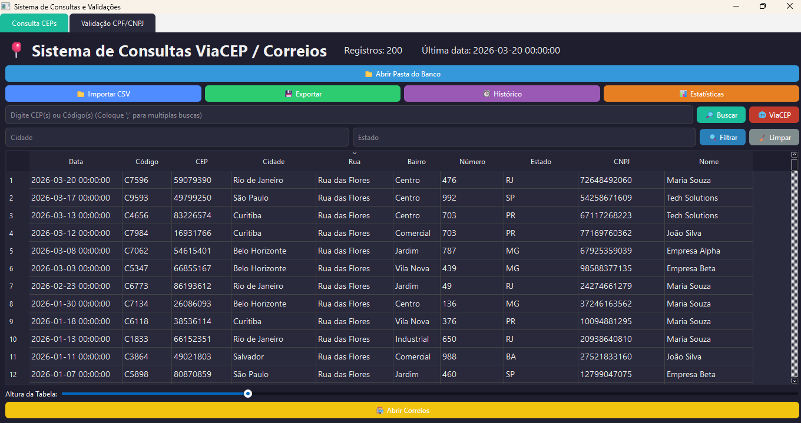
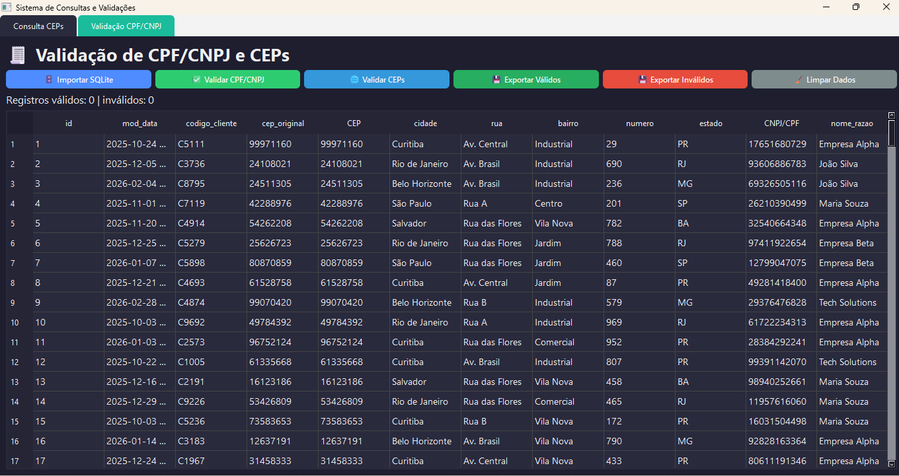

# 🧾 Sistema de Consulta e Validação de CEPs e Documentos

## 🖼️ Preview

### Consulta de CEP


### Validação de Dados


> Ferramenta desktop para validação e higienização de dados com foco em performance e uso corporativo.

## 📌 Sobre o projeto

Este projeto é uma aplicação desktop desenvolvida em Python com foco na **consulta, validação e higienização de dados** relacionados a CEPs e documentos (CPF/CNPJ).

A ferramenta foi construída com o objetivo de simular um cenário real de uso corporativo, permitindo análise de bases, validação em massa, criação automática de banco de dados estruturado a partir de arquivos CSV e integração com APIs externas.

---

## ⚙️ Funcionalidades

- 📂 **Importação de dados** via CSV ou SQLite  
- 🔎 **Consulta de CEPs** por código ou cliente  
- 🌐 **Validação de CEPs** via API (ViaCEP e BrasilAPI)  
- 🧾 **Validação de CPF e CNPJ**  
- 📊 **Estatísticas de uso** e histórico de buscas  
- 💾 **Exportação de dados** válidos e inválidos  
- ⚡ **Processamento assíncrono** para grandes volumes  
- 🧠 **Cache local** para otimização de consultas  
- 🎨 **Interface gráfica moderna** com PyQt6  
- 🚀 **Splash screen animada** com HTML/CSS/JS  
- 🗄️ **Criação automática de banco de dados e tabelas** com base na estrutura do CSV importado  
- 🔄 **Persistência inteligente de dados**, evitando duplicidades através de controle por chave única  

---

## 🏗️ Tecnologias utilizadas

- **Python 3.x**  
- **PyQt6**  
- **Pandas**  
- **SQLite**  
- **Asyncio**  
- **Aiohttp**  
- **Requests**  
- **HTML / CSS / JavaScript** (Splash Screen)  

---

## 🚀 Execução do projeto

### ▶️ Rodando via Python

```bash
python main.py
```

---

### 📦 Gerando executável (.exe)

```bash
pyinstaller --onefile --windowed main.py
```

> O executável será gerado na pasta `dist/`

---

## 🧠 Estrutura do projeto

```bash
.
├── main.py
├── consulta_ceps.py
├── validacao.py
├── splash.html
├── database.db
└── cache_ceps.db
```

> O projeto foi estruturado de forma simples, priorizando legibilidade e entrega funcional.

---

## ⚡ Performance e processamento

- Uso de **asyncio + aiohttp** para validação em massa de CEPs  
- Controle de concorrência com **Semaphore**  
- Processamento em lotes (**batches**) para grandes volumes  
- Cache em **SQLite** para evitar requisições repetidas  

---

## 🧩 Arquitetura

A aplicação segue uma arquitetura simples, com separação básica entre:

- Interface gráfica (**PyQt**)  
- Lógica de validação e processamento  
- Persistência de dados (**SQLite**)  

> 🔄 Futuras evoluções podem incluir separação em camadas (**services**, **repositories**) para maior escalabilidade e manutenibilidade.

---

## 🎯 Objetivo do projeto

Este projeto foi desenvolvido com foco em:

- Simular uma **ferramenta real de uso corporativo**  
- Trabalhar com **manipulação e validação de dados**  
- Aplicar conceitos de **concorrência e performance**  
- Criar uma aplicação completa (**UI + backend + integração externa**)  

---

## 📌 Possíveis melhorias futuras

- Separação em arquitetura em camadas (**services/repositories**)  
- Implementação de **testes automatizados**  
- Melhor organização modular do código  
- **Logs estruturados**  
- Configuração via arquivo `.env`  

---

## 🧪 Dados de teste

O projeto inclui um script para geração de dados fictícios para testes:

```bash
python gerar_teste.py
```
---

## 💬 Observação

Este projeto faz parte do meu processo de evolução como desenvolvedor, com foco em construção de soluções práticas e aplicáveis ao mercado.